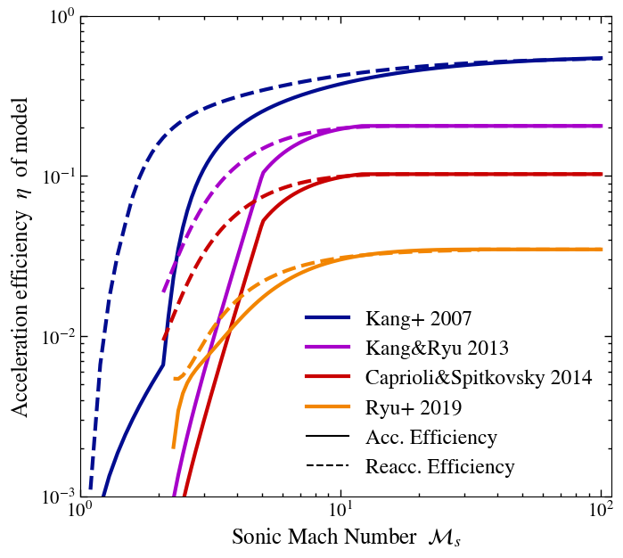

```@meta
CurrentModule = DSAModels
DocTestSetup = quote
    using DSAModels
end
```

# DSAModels.jl

This package provides a number of efficiency models for Diffuse Shock Acceleration (DSA). It provides a number of functions to calculate what fraction of the energy dissipated at a shock is used to accelerate Cosmic Rays (CRs).

# Install

As usual with Julia just run

```
] add https://github.com/LudwigBoess/DSAModels.jl
```

# Mach number dendent efficiency models

Different authors found a number of models that describe the acceleration efficiency of CRs at shocks dependent on the sonic Mach number. Here we implemented the following DSA models:



```@docs
Kang07
```

```@docs
KR13
```

```@docs
CS14
```

```@docs
Ryu19
```

```@docs
P16
```

# Magnetic field angle dependent efficiency models

Another parameter in the acceleration efficiency is the shock obliquity. Here we used the results from [Pais et. al. (2019)](http://arxiv.org/abs/1907.04300) who fit a functional form to the data by [Caprioli&Spitkovsky (2014)](https://ui.adsabs.harvard.edu/abs/2014ApJ...783...91C/abstract).

```@docs
η_B
```

## Ions

Ions are found to be accelerated primarily at quasi-parallel shocks. We provide two helper functions for this.

```@docs
ηB_acc_p
```

```@docs
ηB_reacc_p
```

## Electrons

Electrons are found to be accelerated primarily at quasi-perpendicular shocks. We provide two helper functions for this.

```@docs
ηB_acc_e
```

```@docs
ηB_reacc_e
```

# Usage

To use for example the mach number dependent model by [Kang & Ryu (2013)](https://arxiv.org/pdf/1212.3246.pdf), combined with the shock obliquity model by [Pais et. al. (2019)](http://arxiv.org/abs/1907.04300)

```julia
using DSAModels

ηM_model = KR13()  # Mach number dependent model
Mach = 5.0         # we assume a Mach 5 shock
θ_B  = 0.1π        # angle between shock normal and magnetic field vector
X_cr = 0.0         # X_cr = P_cr / P_th -> in this case no pre-existing CRs

# magnetic field angle dependent acc. efficiency
ηB   = ηB_acc_p(θ_B)  

# Mach number dependent acc. efficiency
ηM   = η_Ms(ηM_model, Mach, X_cr)

# total efficiency
η_tot = ηB * ηM
```